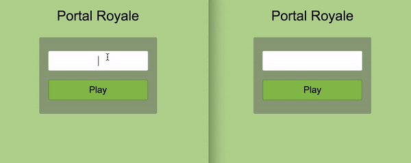
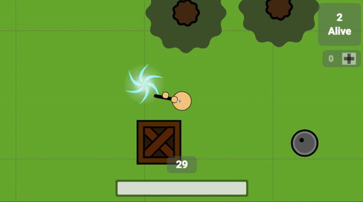
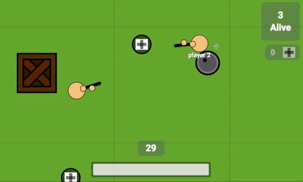
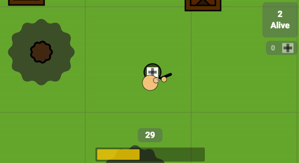
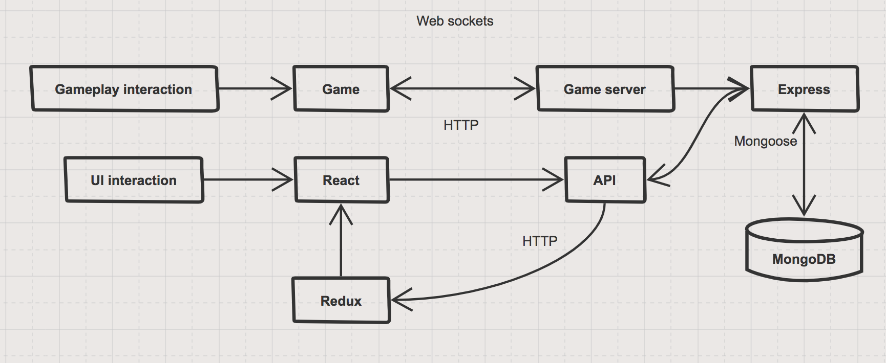
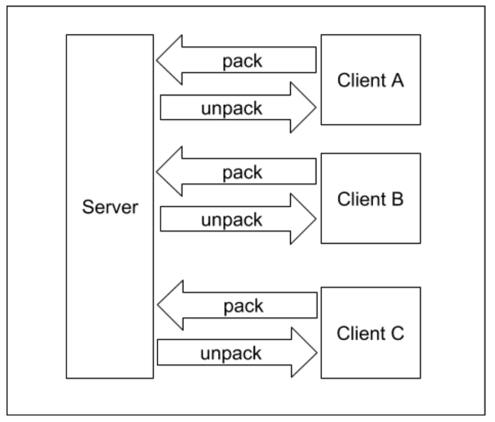

#  Portal Royale

_A multi-player battle royale shooter game_

* [Live Site](http://portalroyale.herokuapp.com/#/)
* [Background and Overview](#background-and-overview)
* [Technologies](#technologies)
* [Technical Implementation](#technical-implementation)
* [Additional Planned Features](#additional-planned-features)
* [Credits](#credits)
* [Group Members](#group-members)

## Background and Overview

Portal Royale is a multi-player battle royale shooter game that is modeled after [surviv.io](http://surviv.io/) - with a twist. In Portal Royale, players are free to use portals that are spawned on the map, which will randomly teleport a player to another location on the map. Will the there be dangers or safety beyond the portal? There's only one way to find out...

## Technologies

Portal Royale is implemented in the MERN stack (MongoDB, Express, React, and Node.js). The real-time game updating is done with Socket.io. The entire game is rendered with HTML5 Canvas.

### Key Features
* Multi-player battle royale
* [Game lobby](#game-lobby) with player ready-up system
* [Portals](#portals)
* [Medkits](#medikits)
* [Exploding Barrels](#exploding-barrels)
* Ammunition Reloading

### Game Lobby
Players must queue up in the game lobby. The game will only start after all players ready up.

### Portals
Players can press F to use a portal that teleports them to another location on the map.

### Exploding Barrels
Exploding barrels can be leveraged to kill other players. Activate explosion by destroying the barrel.

### Medkits
Medkits can be picked up and stored in the inventory. Press 1 to activate medkit and regenerate health.

However, be careful, consuming a medkit will slow the player down until the player's health is replenished.

## Technical Implementation

### Architecture

### Server-Client Interaction
The server keeps tracks of all the game objects created and communicates updates all clients on changes in the game. The client is responsible for creating game objects based on the server's instructions and rendering the game. The game object information is packed and sent to the server. Instructions received from the server are unpacked and subsequently use for updating game state.

### Game Objects and Components
Each client has a local Game instance that receives instructions from the server on what game objects should be created in the game. Each entity in the game is a `gameObject`. For example, players, trees, and barrels are `gameObjects` within the game.

The properties of each gameObject is determined by the `Components` that is associated to the `gameObject`. For example, all Player `game objects` have a `Hitpoint` Component and a `Movement` Component because all players have a finite amount of health and the ability to move freely within the game map.

## Additional Planned Features
* Item drops from boxes
* Livefeed for kills

## Credits

A special thanks to the following technologies/resources that made this project possible:
* [Node.js](https://nodejs.org/en/)
* [Socket.io](https://socket.io/)
* [React Spinners](http://www.davidhu.io/react-spinners/)
* [App Academy](https://www.appacademy.io/)

## Group Members
* [Jeremiah](https://github.com/jeremiahkellick)
* [Danny](https://github.com/OnlyChobo)
* [Jingna](https://github.com/jli57)
* [AJ](https://github.com/ajgosling)